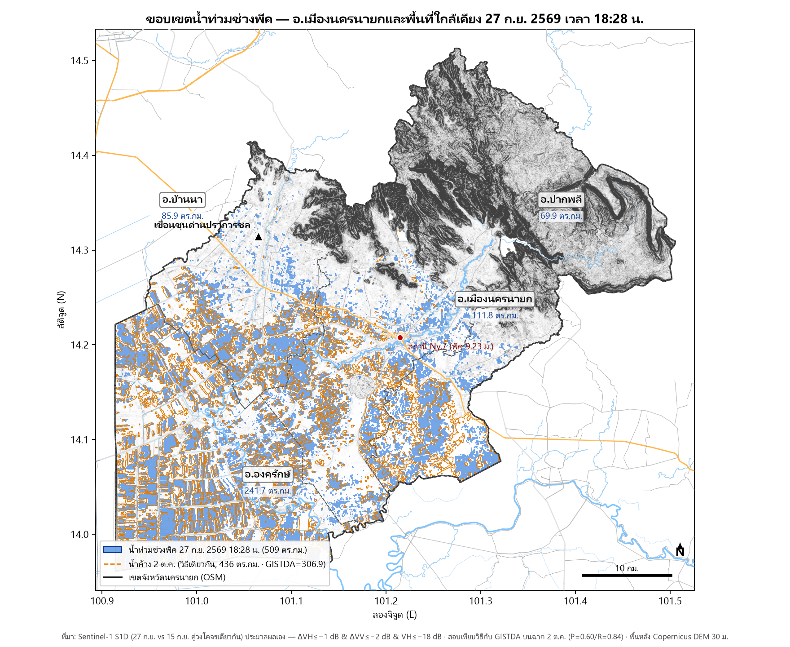

# การสอบสวนเชิงหลักฐาน: น้ำท่วมนครนายก ปลายกันยายน 2569

> 📖 **อ่านรายงานออนไลน์ได้ทันที:** **[tkittich.github.io/nnyflood](https://tkittich.github.io/nnyflood/)**
>
> การวิเคราะห์บทบาทของ **ฝนตกหนักเป็นแถบ** เทียบกับ **การบริหารน้ำของเขื่อนขุนด่านปราการชล**
> ต่อน้ำท่วม อ.เมือง นครนายก (26–29 กันยายน 2569) — ด้วยข้อมูลเปิดเผยสาธารณะ + การประมวลผลดาวเทียมเอง
>
> **🟦 รายงานฉบับประชาชน (อ่านง่าย):** [อ่านออนไลน์](<https://tkittich.github.io/nnyflood/report/น้ำท่วมนครนายก2569_ประชาชน.html>) · [ดาวน์โหลดไฟล์เดียวจบ](report/น้ำท่วมนครนายก2569_ประชาชน.html) (เปิดได้ถาวรแม้ไม่มีเน็ต)
>
> **🟩 ฉบับวิชาการ (ตรวจสอบย้อนกลับได้ทุกตัวเลข):** [อ่านออนไลน์](<https://tkittich.github.io/nnyflood/report/น้ำท่วมนครนายก2569_วิชาการ.html>) · [ดาวน์โหลดไฟล์เดียวจบ](report/น้ำท่วมนครนายก2569_วิชาการ.html)

**TL;DR (ไทย):** ตัวจุดชนวนคือ**ฝน 18 วัน 1,058–1,416 มม. บนลุ่มที่อิ่มตัวแล้ว** — แม้เขื่อนไม่ปล่อยน้ำเลย น้ำก็ท่วมคืน 26 ก.ย. · แต่การปล่อยน้ำช่วงน้ำสูงสุดคือตัว**ยืดเวลาท่วมขัง**: น้ำเขื่อนคิดเป็น **59% ของน้ำที่ไหลผ่านเมืองช่วงน้ำขัง** และถ้า "หยุดปล่อยผ่านช่วงน้ำสูงสุดเมือง 48–72 ชม." น้ำล้นตลิ่งลดได้ **55–93%** · ทุกตัวเลขทำซ้ำได้จากข้อมูลสาธารณะล้วน (Sentinel-1 SAR · โทรมาตร กช. · Copernicus DEM)

**English TL;DR:** The flood was triggered by 18 days of orographic rain (1,058–1,416 mm) on an already-saturated basin — rain alone put the city gauge past its flooding threshold. The dam's releases did not create the flood peak, but they *extended* the ponding: dam water made up **59% of all water passing the city** during the flood, and "stop releasing through the 48–72 h city-peak window" scenarios cut overbank volume by **55–93%**. Every number is reproducible from public data alone (Sentinel-1 SAR, RID telemetry, Copernicus DEM) — reports are in Thai; scripts, evidence and tests are in this repo.



*แผนที่น้ำท่วมน้ำสูงสุด เย็น 27 ก.ย. 2569 — 509 ตร.กม. จากการประมวลผล Sentinel-1 เอง · ที่ราบโทนครีม ภูเขาโทนน้ำตาล · ถนนและแม่น้ำจาก OpenStreetMap · พื้นที่น้ำท่วมสีน้ำเงิน*

---

## สิ่งที่รายงานตอบได้

| คำถาม | คำตอบ (สรุป) | หลักฐาน |
|---|---|---|
| ทำไมน้ำท่วม? | ฝน 18 วัน 1,058–1,416 มม. **ตกเชิงเขา+ที่ราบ** ไม่ใช่ในเขาใหญ่ · ลุ่มอิ่มน้ำ 19 ก.ย. (ฝน 1 มม. ให้ผลเพิ่ม 5 เท่า) | ฝน 12 สถานี + ระดับน้ำรายชั่วโมง |
| เขื่อนมีส่วนไหม? | **ฝนเป็นตัวจุดชนวน (88%) · การปล่อยน้ำยืดเวลาท่วมขัง (59% ในช่วงน้ำขัง)** — วัดจากไฮโดรกราฟจริง | โทรมาตรเขื่อน 15 นาที |
| ท่วมกว้างเท่าไร? | น้ำสูงสุด 27 ก.ย. เย็น **509 ตร.กม.** (ประมวลผล Sentinel-1 เอง; เทียบเท่านิยาม GISTDA ~360) | 17 ฉาก Sentinel-1 |
| เขื่อนทำตามมาตรฐานไหม? | เก็บน้ำเหนือเส้นควบคุมบน (URC) 36 วันต่อเนื่องก่อนพายุ · ตารางระบายของโครงการไม่มีกลไก URC | ข้อมูลอ่าง 14 ปี + ผังน้ำ สทนช. |
| ถ้าบริหารดีที่สุดจะดีกว่าไหม? | **ทำตาม URC = น้ำล้น −55% ท่วม 65→18 ชม.** · ใช้พยากรณ์ปรับระดับล่วงหน้า = **−93% ท่วมข้ามคืนเดียว** | จำลองคุมความจุอ่างทุกแผน |
| เตือนภัยล่วงหน้าได้ไหม? | สัญญาณมีจริงล่วงหน้า 4 วัน (Google Flood Hub 22 ก.ย.) · โมเดลทำนายระดับ Ny.7 (จากข้อมูล 5 ปี) RMSE 0.75 ม. ที่ 24 ชม. (ทั้งช่วงทดสอบ; เฉพาะช่วงเหตุการณ์ 1.09 ม. — ดู DATA_DICTIONARY) | โมเดล + ฝนพยากรณ์ 5 โมเดลโลก |

## โครงสร้าง repository

```
START_HERE.md        ← อ่านก่อน: ลำดับการอ่าน + คำสั่งทำซ้ำตัวเลขหัวใจ
report/              ← รายงานส่งมอบ 2 ฉบับ (ไฟล์ HTML เดียวจบ)
docs/                ← มาตรฐานวิธีการ + พจนานุกรมข้อมูล + แหล่งข้อมูล
analysis/            ← สคริปต์ประมวลผล + ผลสังเคราะห์ (CSV/JSON/PNG/MD)
data/                ← หลักฐานต้นฉบับ 21 ชุด (ทุกชุดมี manifest + SHA-256)
tests/               ← ชุดทดสอบ 26 ตัว (กัน regression)
index.html           ← หน้ารวมลิงก์รายงาน (เสิร์ฟโดย GitHub Pages)
```

## ข้อค้นพบหลัก 5 ข้อ

1. **ฝนคือตัวจุดชนวน เขื่อนคือตัวยืดเวลา** — ฝน 18 วัน 1,058–1,416 มม. ตกเชิงเขาและที่ราบ
   (ไม่ใช่เขาใหญ่) บนลุ่มที่อิ่มตัวแล้วตั้งแต่ 19 ก.ย. แม้เขื่อนกักน้ำได้มากที่สุด ระดับน้ำเมืองก็ข้าม
   เกณฑ์เริ่มท่วมคืน 26 ก.ย. แล้ว (ฝนอย่างเดียวให้น้ำสูงสุด 8.75 > 8.45 ม.) · แต่น้ำปล่อยเขื่อนคิดเป็น **59% ของน้ำ
   ที่ไหลผ่านเมืองช่วงน้ำขัง** (12% ช่วงน้ำขึ้น) และทำให้ท่วมขังยาวถึง 65 ชม. — วัดจากโทรมาตร
   ทุก 15 นาที
2. **ปัจจัยชี้ขาดของการบริหารคือ "หน้าต่างเวลา" ไม่ใช่ "ปริมาตร"** — ทำตามเส้นควบคุมบน (URC)
   = น้ำล้น −55% ท่วม 65→18 ชม. · ระบายน้ำออกจากอ่างล่วงหน้าเพียง 13 ลลบ.ม. พร้อมหยุดปล่อยผ่านช่วงน้ำสูงสุดเมือง
   = **−93% ท่วมแค่ข้ามคืนเดียว** — ผลเทียบเท่าการระบายออกจากอ่างมากถึง 84 ลลบ.ม. เพราะสิ่งที่ต่างจริงๆ
   คือ "หยุดปล่อย 26–28 ก.ย."
3. **พื้นที่ท่วมน้ำสูงสุด 509 ตร.กม. วัดได้เองจากดาวเทียมสาธารณะ** — ประมวลผล Sentinel-1 17 ฉาก
   ครอบทั้งเหตุการณ์ (9 ก.ย.–2 ต.ค.) ด้วยกฎการตรวจจับที่สอบเทียบกับผลิตภัณฑ์ทางการ
   (F1 0.70 บนฉากเดียวกัน) — ภาพรายวันช่วงน้ำสูงสุดไม่มีผู้ใดมีมาก่อน
4. **สัญญาณเตือนล่วงหน้า 4 วันมีอยู่จริงในข้อมูลสาธารณะ** — Google Flood Hub และโพสต์พยากรณ์
   เอกชนระบุอุทกภัยลุ่มนครนายกล่วงหน้าตั้งแต่ 22 ก.ย. · และโมเดลเส้นตรงจากโทรมาตร 5 ปี
   ทำนายระดับน้ำ 24 ชม. ล่วงหน้าได้ RMSE 0.75 ม. — "เตือนภัยด้วยข้อมูลเปิดล้วน" เป็นไปได้จริง
5. **บทเรียนวิธีวิทยาสามข้อ** — (ก) การตรวจจับน้ำด้วยดาวเทียมอัตโนมัติมีข้อจำกัดชัดเจนช่วง
   ฝนหนัก/น้ำไหลแรง: ในฉาก Sentinel-1 ตอนเช้าวันน้ำสูงสุดฉากเดียวกัน การประมวลผลอิสระของเรา
   เห็น 62.2 ตร.กม. ขณะที่ผลิตภัณฑ์สาธารณะรายงาน 8.3 ตร.กม. (ระดับน้ำจริงขณะนั้นใกล้น้ำสูงสุด)
   จึงไม่ควรตัดสินสถานการณ์จากผลิตภัณฑ์เดียว · (ข) เหตุการณ์สุดขั้วทำโมเดล tree (GBDT)
   ใช้ไม่ได้ — สูตรเส้นตรงชนะ เพราะระดับสูงสุดจริงเกินช่วงฝึก · (ค) นิยาม "ระดับล้นตลิ่ง" ต่างกันได้
   ~1.4 ม.: น้ำสูงสุด 7.64 ม.รทก. ไม่ล้นสันตลิ่งจริง (8.21 ม.รทก.) แต่ท่วมที่ราบริมซึ่งต่ำกว่าสันตลิ่ง —
   หน้าตัดจริงของ กช. ยืนยันข้อนี้

## การทำซ้ำ (reproduce)

ดู `START_HERE.md` §4 — ตัวเลขหัวใจทุกตัวทำซ้ำได้ด้วยคำสั่งบรรทัดเดียว
(ส่วนใหญ่รันได้จาก clone เปล่า; ส่วนดาวเทียมต้องมีฉากดิบบนดิสก์ — มี SHA-256 ให้ตรวจ)

```bash
pip install -r requirements.txt
python -m pytest tests/ -q                       # 26 passed
python analysis/goal4_model_v1.py                # โมเดลทำนายหลัก
python analysis/verify_data_integrity.py --quick # ตรวจแฮชข้อมูล
```

การตรวจสอบคุณภาพที่ทำไว้กับชุดข้อมูลนี้: ชุดทดสอบอัตโนมัติ 26 ตัวผ่านทั้งหมด (รวมตรวจตัวเลขหัวใจใน artifact) ·
ตรวจความครบถ้วนข้อมูลต้นฉบับ 681 ไฟล์ด้วย SHA-256 ผ่านทั้งหมด ·
ตัวเลขสำคัญทุกตัวข้ามสอบอย่างน้อย 2 แหล่งอิสระ (เมทริกซ์ในฉบับวิชาการ §5)

## ข้อจำกัดและการอ้างอิง

- **รายงานทั้งหมดจัดทำโดย AI** — ควรตรวจทานโดยผู้เชี่ยวชาญด้านอุทกวิทยา/วิศวกรรมก่อนนำไปใช้เชิงกฎหมายหรือนโยบาย
- ข้อมูลดิบบางชุด (~25 GB: ฉากดาวเทียม ภาพอัลบั้ม PDF) ไม่อยู่ใน git — มี SHA-256 + manifest ให้ตรวจความครบถ้วน
- ตัวเลขคลื่น/ระดับในแบบจำลองสถานการณ์มีความไม่แน่นอนตามที่กำกับ (rating ±18–20%, lag ±6 ชม.)
- ข้อมูลบางส่วนมีลิขสิทธิ์ (mitrearth GIS, ภาพประชาชน) — ใช้เพื่อการศึกษา/อ้างอิงสาธารณะ
- Sentinel data: Contains modified Copernicus Sentinel data (2026)/ESA · GISTDA/กรมชลประทาน/สทนช. (ทางการ)

## สัญญาอนุญาต · การอ้างอิง · การติดต่อ

- **โค้ด รายงาน และผลวิเคราะห์ของโปรเจกต์นี้:** สัญญาอนุญาต [CC BY 4.0](LICENSE) — ใช้ต่อ/แบ่งปันได้เสรี ขอเพียงอ้างอิงแหล่งที่มา
- **ข้อมูลของบุคคลที่สาม** (OpenStreetMap, Copernicus/ESA, GISTDA, NASA, Open-Meteo ฯลฯ) มีเงื่อนไขของตัวเอง — สรุปครบทุกแหล่งใน [THIRD_PARTY_NOTICES.md](THIRD_PARTY_NOTICES.md)
- **อ้างอิงทางวิชาการ:**

  ```bibtex
  @misc{nnyflood2026,
    author       = {tkittich},
    title        = {น้ำท่วมนครนายก 26--29 กันยายน 2569: การสอบสวนเชิงหลักฐานจากข้อมูลเปิด},
    year         = {2026},
    howpublished = {\url{https://github.com/tkittich/nnyflood}},
    note         = {รายงานจัดทำโดย AI ร่วมกับเจ้าของโปรเจกต์}
  }
  ```

- **ติดต่อ/ชี้ข้อผิดพลาด/ขอใช้สิทธิ์เกี่ยวกับข้อมูลส่วนบุคคล (PDPA):** เปิด [Issue](https://github.com/tkittich/nnyflood/issues) ได้เลย — บันทึกการตรวจทานกฎหมายก่อนเผยแพร่อยู่ที่ [docs/LEGAL_REVIEW.md](docs/LEGAL_REVIEW.md)

## เอกสารทั้งหมด

| เอกสาร | เนื้อหา |
|---|---|
| `START_HERE.md` | ทางเข้า + คำสั่งทำซ้ำ + กับดักที่เจอ |
| `docs/METHODS.md` | มาตรฐานหลักฐาน `[F]/[I]/[O]` + วิธีประมวลผล S1 + โมเดลทำนาย |
| `docs/DATA_SOURCES.md` | แหล่งข้อมูล 21 ชุด + สถานะการเข้าถึง |
| `docs/DATA_DICTIONARY.md` | นิยามตัวเลขทางการทุกตัว (canonical) + ฟิลด์ข้อมูล |
| `docs/ANALYSIS_PLAN.md` | คำถามวิเคราะห์ A–D + สถานะ |
| `docs/ENVIRONMENT.md` | สภาพแวดล้อม Python ที่ตัวเลขผลิตด้วยจริง |
| `docs/reviews/` | รีวิวอิสระรอบใหม่ (DeepSeek R-01..R-13 · Gemini) + สถานะการตอบ |
| `HANDOFF.md` | สถานะโครงการล่าสุด (publish แล้ว 8 ต.ค. 69) + บทเรียนเทคนิคที่เจอ |
| `analysis/*_findings.md` | บทวิเคราะห์เชิงลึกแต่ละหัวข้อ |

---

*จัดทำเมื่อ ตุลาคม 2569 · รายงานจัดทำโดย AI ร่วมกับเจ้าของโปรเจกต์ — ตรวจสอบย้อนกลับได้ทุกตัวเลข*
